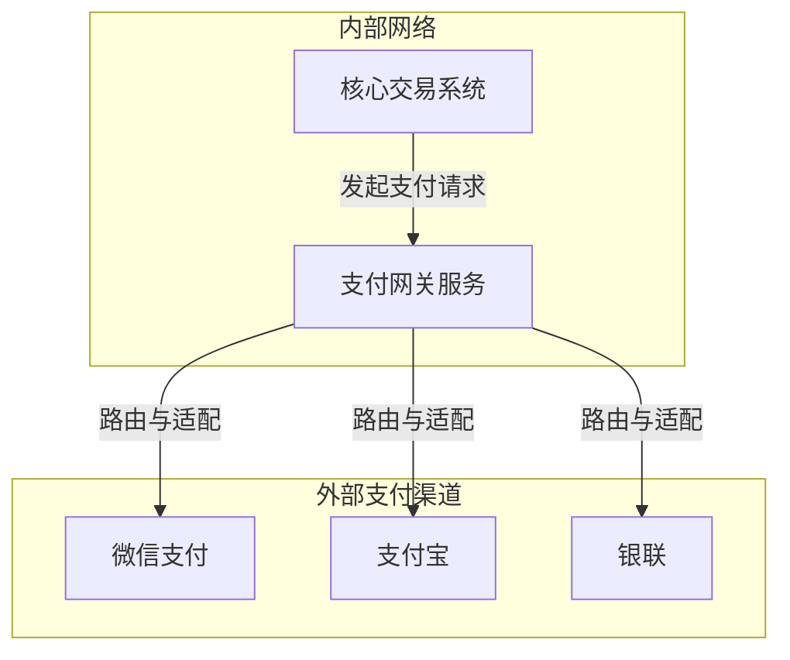
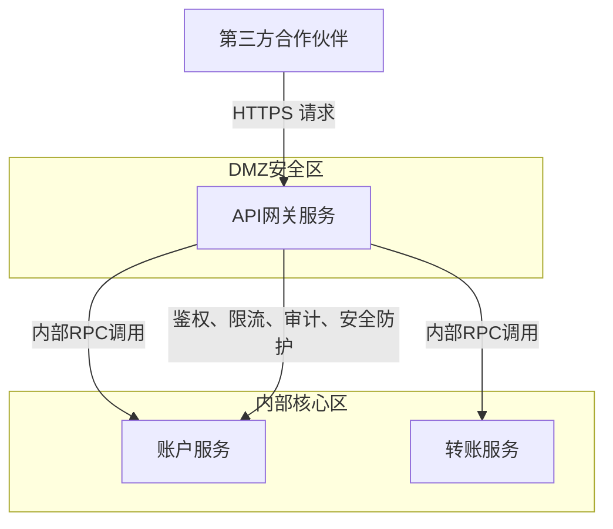

# 分布式系统

[toc]


## 1） 分布式锁

### 1.1）Redisson 分布式锁

Redisson 支持读写锁、公平锁，自动对锁续期。

**Redisson 加锁时使用 Redis 哪种结构？重入锁是如何实现的？**

Redisson 加锁时使用  Redis 的 map 数据结构实现，使用 exists 判断锁是否存在，如果不存在使用 hset 命令， key 为锁的名称，value 为 map, map 的 field 为 {clientId}:{threadId}, value 为重入次数， hincrby  设置重入次数, pexpire 设置过期时间。

**如何保证加锁和解锁都是同一个线程？**

{clientId}:{threadId} 作为 map 的 key。

**如何实现自动地给锁续期？**

Redisson 借助看门狗机制实现对锁的自动续期，所谓看门狗机制其实就是一个 Netty 定时任务，每10秒执行一次,  通过 Lua 脚本原子性刷新锁的过期时间。

```
// Lua脚本：仅当锁仍属于当前客户端时，才刷新过期时间（避免续期其他客户端的锁）
            "if (redis.call('hexists', KEYS[1], ARGV[2]) == 1) then " +
                "redis.call('pexpire', KEYS[1], ARGV[1]); " + // 刷新为30秒
                "return 1; " +
            "end; " +
            "return 0;",
```

加锁失败如何处理？

1. **尝试获取锁**：tryLock， lock， tryLockAsync 尝试获取锁，失败则返回锁的剩余 TTL（过期时间）。
2. **订阅释放通知**：若允许等待（`waitTime > 0`），通过 Redis Pub/Sub 订阅锁的释放频道。
3. **阻塞等待**：基于信号量（Semaphore）阻塞线程，等待锁释放通知或超时。
4. **唤醒重试**：收到通知后重新尝试获取锁，直到成功、超时或被中断。

**Redisson 实现分布式锁的缺陷**：

当获取锁的节点因 GC 出现较长时间的 STW 或 节点因为暂时性的网络分区导致锁未能正常续期，导致锁过期被意外释放，其他节点获取到锁。

### 1.2）Redisson 红锁（RedLock）

Redisson 的红锁（RedLock）是基于 Redis 实现的分布式锁增强方案，主要用于解决 **单节点 Redis 故障导致的锁失效问题**，通过多节点协同确保分布式锁的高可用性。以下是其实现原理及设计初衷：

一、红锁（RedLock）的核心设计目标

在单节点 Redis 中，若 Redis 节点宕机（如主节点崩溃且从节点未及时同步锁信息），可能导致锁丢失，引发并发安全问题。红锁的目标是：**通过多个独立的 Redis 节点（通常 3-5 个）共同持有锁，只有当多数节点（超过半数）成功获取锁时，才认为锁获取成功**，从而降低单节点故障的影响。

 二、Redisson 红锁的实现原理

Redisson 红锁（`RedissonRedLock`）基于 Redis 官方红锁算法实现，核心流程包括 **锁获取、锁释放、超时控制** 三个阶段，以下是关键步骤：

1. 初始化多节点锁

红锁需要操作多个独立的 Redis 节点（无主从关系，避免集群整体故障），每个节点对应一个普通的 Redisson 锁（如 `RLock`）。

 2. 锁获取流程（核心逻辑）

红锁获取需满足 **“多数节点成功 + 总耗时小于锁超时时间”**，步骤如下：

1. **计算超时时间**：红锁的总超时时间（`lockWaitTime`）需提前设定（如 500ms），用于控制单个节点的获取超时。
2. **逐个获取节点锁**：
   - 向每个 Redis 节点发送加锁请求（与普通 `RLock` 逻辑相同，基于 Hash 结构和 Lua 脚本）。
   - 每个节点的加锁超时时间为 `lockWaitTime / 节点数`（如 500ms / 3 ≈ 166ms），避免单个节点阻塞过久。
3. **判断获取结果**：
   - 统计成功获取锁的节点数量，若 **成功数 > 节点总数 / 2**（如 3 个节点需至少 2 个成功），且总耗时 < 锁的有效时间（`leaseTime`），则红锁获取成功。
   - 若失败，立即释放所有已获取的节点锁（避免残留锁）

3. 锁释放流程

红锁释放时，需 **释放所有节点的锁**（无论加锁时是否成功），确保不会残留任何节点的锁信息。

4. 看门狗续期机制

与普通锁类似，红锁在未指定 `leaseTime` 时，会启用看门狗机制：

- 定期（默认 10 秒）向所有已获取锁的节点发送续期请求，将锁的过期时间刷新为 30 秒。
- 确保业务未完成时，红锁不会因超时自动释放。

三、为什么需要红锁？

红锁的设计源于单节点 / 主从架构 Redis 锁的局限性：

1. **单节点故障风险**：若 Redis 单节点宕机，锁数据丢失，其他线程可能重新获取锁，导致并发冲突。
2. **主从同步延迟**：主从架构中，主节点锁信息未同步到从节点时主节点崩溃，从节点升级为主节点后无锁信息，同样会导致锁丢失。

红锁通过 **多节点冗余** 解决上述问题：

- 只有多数节点（超过半数）持有锁时，才认为锁有效，单个节点故障不会导致锁失效。
- 适用于对分布式锁安全性要求极高的场景（如金融交易、库存扣减等）。

四、Redisson 红锁解决了 锁漂移的问题吗？

Redisson 红锁（RedLock）**并没有从根本上 “解决” 锁漂移问题，但通过多节点冗余校验，大幅降低了锁漂移的概率和影响范围**—— 它的核心目标是解决 Redis 单点 / 集群故障导致的 “锁失效” 问题，而非直接针对 GC STW 这类客户端层面的锁漂移场景，但能通过设计间接缓解。

`RedissonRedLock` 继承自 RedissonMultiLock， 已被标记为 **@Deprecated（废弃）**

原因是：

- `RedissonRedLock` 本身没有独立底层实现，仅重写了 `RedissonMultiLock` 的 3 个规则方法 —— 这种 “子类适配” 的实现方式冗余，可通过 `RedissonMultiLock` 的参数配置直接实现红锁逻辑；
- Redis 作者曾指出红锁算法在极端网络分区场景下存在理论缺陷（如多节点时间不同步导致的锁漂移风险），Redisson 官方虽未完全否定红锁，但不再推荐作为 “高可用锁的首选”；
- Redisson 后续提供了 `RedissonQuorumLock`（仲裁锁）等更灵活的实现，支持自定义 “成功节点数阈值”，既能实现红锁的 “过半规则”，也能适配其他场景（如 3 节点需 2 个成功、5 节点需 4 个成功），通用性更强。

### 1.3）基于 ZooKeeper 实现分布式锁

Apache Curator 是 Netflix公司开源的一套Zookeeper客户端框架，支持可重入锁（`InterProcessMutex`）、公平锁（`InterProcessFairLock`）、读写锁（`InterProcessReadWriteLock`）、信号量（`InterProcessSemaphore`）、红锁（`InterProcessMultiLock`）等多种锁类型。

Spring Integration Zookeeper 是 Spring 官方提供的 ZooKeeper 集成模块，内置分布式锁实现，适合已使用 Spring 生态（如 Spring Boot、Spring Cloud）的项目，无需额外引入第三方非 Spring 依赖。

Curator 实现分布式锁的核心是 **借助 ZooKeeper（ZK）的核心特性（临时有序节点、Watcher 监听、会话机制）**，封装了复杂的锁竞争、释放、超时处理逻辑，最终提供简单易用的分布式锁 API。

Curator 依赖的 3 个 ZK 核心特性

| ZK 核心特性                 | 作用(为分布式锁服务)                                         |
| --------------------------- | ------------------------------------------------------------ |
| 临时节点（Ephemeral Node）  | 锁的 “占位符”：客户端创建临时节点表示 “持有锁”，客户端与 ZK 会话断开（如服务宕机）时，节点自动删除，锁自动释放（避免死锁）。 |
| 有序节点（Sequential Node） | 解决锁竞争：多个客户端同时抢锁时，创建带自增序号的节点（如 `/lock/order-000000001`），通过序号大小决定竞争优先级（公平锁基础）。 |
| Watcher 监听机制            | 实现 “等待 - 唤醒”：未抢到锁的客户端，监听前一个序号的节点，当前序节点删除（锁释放）时，触发监听回调，重新尝试抢锁（避免轮询，降低资源消耗）。 |
| 节点唯一性                  | 同一路径的节点不可重复创建：确保同一时刻只有一个客户端能创建 “目标节点”（非有序节点场景），但 Curator 更多用有序节点实现公平竞争。 |

Curator 的 `InterProcessMutex` 是最常用的可重入分布式锁，其底层完全基于 ZK 的 “临时有序节点 + Watcher 监听” 实现，整体流程可概括为 **“创建节点 → 判断优先级 → 抢锁成功 / 监听等待 → 释放锁”**

与 Redisson 的核心差异

| 特性     | Apache Curator（ZK 实现）                | Redisson（Redis 实现）               |
| -------- | ---------------------------------------- | ------------------------------------ |
| 底层依赖 | ZooKeeper（强一致性）                    | Redis（最终一致性）                  |
| 锁可靠性 | 高（基于 ZK 临时节点，会话断开自动释放） | 中（需依赖 Redis 集群 + 看门狗机制） |
| 功能覆盖 | 全量（支持红锁、信号量等）               | 更丰富（支持分布式集合、队列等）     |
| 性能     | 中（ZK 集群写入需同步）                  | 高（Redis 内存操作）                 |
| 适用场景 | 强一致性需求（如分布式事务、数据同步）   | 高性能需求（如秒杀、缓存更新）       |


分布式系统下如何判断节点是否存活？

Unreliable Failure Detectors for Reliable Distributed Systems。

Leases: An Efficient Fault-Tolerant Mechanism for Distributed File Cache Consistency。


### 1.4）本地锁与分布式锁

同一服务多个线程同时请求获取锁，导致分布式锁服务负载特别高，能否通过某种方式来缓解分布式锁服务的压力呢？

使用 synchronized、ReentrantLock 本地锁先加锁，本地锁加锁成功后再去获取分布式锁。

```
public void doSomething(String lockKey) {
    synchronized (lockKey.intern()) {
        disLock.lock(lockKey, timeout: 200);
        try {
            //do something
        } finally {
            disLock.unLock(lockKey, null);
        }
    }
}
```


**拓展：本地优先分布式锁实现**：https://github.com/EvanMi/local-first-distribute-lock.git


## 2）分布式事务

分布式事务是指 **跨越多个独立服务 / 数据源** 的事务。核心要求依然遵循 ACID 原则（原子性、一致性、隔离性、持久性）。在分布式的场景下，更多的是强调**原子性**。

在没有网络隔离的本地事务是由内存总线和数据库的一个连接去保证本地事务的一个原子性，但是在分布式情况下由于网络隔离的不可靠性，没办法统一去协调同步各个节点成功失败状态，因此在多进程环境下引入事务协调器，完成同步多个节点状态和行为。

多节点行为上的同步就两种情况要么全部成功，要么全失败。协同多个节点执行本地事务，其中一个节点失败，是把之前的事务回滚还是让失败的事务不断重试(努力通知型)？这要结合具体业务，判断采取哪种方案。以下单链路举例，下单链路包含订单更新和库存扣减，先更新订单状态，再去扣减库存，扣减库存失败，再去重试没有意义，此时要回滚订单状态。如果是物流服务，发货后更新订单状态，发货已经执行成功，更新订单可能因为网络原因超时，这种业务就比较适合不断重试，达到一个最终一致的状态。

不管说是回退还是重试都可以借助MQ的消息重试机制，MQ优点就是异步、解耦，有一定的消息堆积能力，MQ重试也是有一定上限的，重试达到上限后会放到死信队列里，死信队列一般都是业务上确实有些逻辑性的问题，导致一直重试不成功，这种就需要人工介入，分布式事务最后一步就是人工兜底。

分布式事务没有一个完美的解决方案，尽量还是在做服务拆分时就把一些原子性的操作放在单进程但数据库里执行，由本地事务去保证ACID特性。


### 2.1）最终一致性方案

#### 2.1.1）本地消息表

本地消息表解决方案基于 “消息的可靠传递” 实现最终一致性，核心思路是 “将分布式事务转化为本地事务 + 消息通知”，分两步：

本地事务：业务操作（如创建订单）与 “发送消息”（消息写入本地消息表）放在同一个本地事务中，确保 “业务成功则消息必存”；

消息投递：本地消息表解决方案根据消息投递不同，有很多变种，第一种本地消息表解决方案是是通过手动/定时任务扫描本地消息表，将未投递的消息投递到消息队列（如 RocketMQ、Kafka）；接收方消费消息后执行后续操作（如扣减库存），消费成功后通知发送方删除消息。优点是性能跟可靠性都是非常高的，缺点是，依赖于定时任务周期， 相比直接投递的方式，它的延迟会更大，实时较差。第二种本地消息表的解决方案实时投递，有两种实现方式一是执行本地业务→写消息表→ 消息投递→删除流水表(本地业务与写消息表放到同一个事务里·)，二是消息投递→消息投递失败时写流水表→本地业务 。第二种方式如果在消息投递开始之前则无法回滚本地事务，原因是

情况 1：外部调用成功，但本地事务想回滚（不可能）

假设流程是：

- 订单服务开启本地事务→调用库存服务扣库存（成功，库存已减少）→ 订单服务因其他原因（比如自身代码异常）想回滚本地事务。
- 此时本地事务能回滚 “创建订单” 的操作（订单表数据删除），但**无法回滚 “库存服务已扣减的库存”** —— 库存服务的操作是独立的本地事务（扣库存后已提交），订单服务的本地事务管不到它。
- 最终结果：库存少了，但订单没了（数据不一致，钱货两空）。

情况 2：外部调用失败，写消息表后回滚（无意义）

假设流程是：

- 订单服务开启本地事务→调用库存服务扣库存（失败）→ 写消息表（记录重试任务）→ 此时想回滚本地事务。
- 回滚后，“写消息表” 的操作会被撤销，“创建订单” 的操作也会被撤销 —— 但这违背了 “失败后写消息表重试” 的初衷（原本是想 “订单创建成功，只是扣库存失败，后续重试”）。
- 若强行回滚，会导致：订单没创建，消息表也没记录，相当于整个流程白走，完全失去了 “重试” 的意义。

本质结论：

“先调用外部服务” 的前提下，本地事务的 “回滚” 要么是 “做不到”（回滚不了外部服务），要么是 “没必要”（回滚会撤销重试依据）。所以视频中说 “投递之前开启事务就没办法做回滚”，实际是指 “这种流程下，回滚无法解决跨节点一致性问题，反而会导致逻辑混乱”。

参考：[分布式事务悲观控制法，本地消息表方案对比，极端情况与性能权衡_哔哩哔哩_bilibili](https://www.bilibili.com/video/BV1TP411f7Rg/?spm_id_from=333.788.recommend_more_video.1&trackid=web_related_0.router-related-2206419-t84qs.1762514480503.574&vd_source=a44de6033b8c062af031b64fe746f310)

本地消息表设计：

```
CREATE TABLE `local_message` (
  `id` bigint(20) NOT NULL AUTO_INCREMENT COMMENT '主键ID',
  `message_id` varchar(64) NOT NULL COMMENT '消息唯一标识（UUID）',
  `business_type` varchar(32) NOT NULL COMMENT '业务类型（如：ORDER_CREATE=订单创建）',
  `business_id` varchar(64) NOT NULL COMMENT '业务关联ID（如：订单ID）',
  `message_content` text NOT NULL COMMENT '消息内容（JSON格式，如：{productId:1001, quantity:2}）',
  `target_topic` varchar(64) NOT NULL COMMENT '消息队列目标主题（如：stock-deduct-topic）',
  `status` tinyint(4) NOT NULL COMMENT '消息状态：0=待投递，1=投递中，2=已完成，3=失败',
  `retry_count` int(11) NOT NULL DEFAULT 0 COMMENT '已重试次数',
  `max_retry_count` int(11) NOT NULL DEFAULT 5 COMMENT '最大重试次数',
  `next_retry_time` datetime NOT NULL COMMENT '下次重试时间（避免频繁重试）',
  `create_time` datetime NOT NULL DEFAULT CURRENT_TIMESTAMP COMMENT '创建时间',
  `update_time` datetime NOT NULL DEFAULT CURRENT_TIMESTAMP ON UPDATE CURRENT_TIMESTAMP COMMENT '更新时间',
  PRIMARY KEY (`id`),
  UNIQUE KEY `uk_message_id` (`message_id`) COMMENT '避免消息重复插入',
  INDEX `idx_status_next_retry` (`status`, `next_retry_time`) COMMENT '定时任务扫描索引'
) ENGINE=InnoDB DEFAULT CHARSET=utf8mb4 COMMENT='本地消息表';
```


#### 2.1.2 ) 最大努力通知（Best-Effort Delivery）

最简化的最终一致性方案，发送方通过 “重试机制” 尽可能将消息通知到接收方，接收方通过幂等性处理确保重复通知无副作用；若重试多次失败，可人工介入或放弃。**适用场景**：对一致性要求极低、允许人工干预的场景（如短信通知、日志同步、非核心业务的状态同步）。

最大努力通知与本地消息表的区别：

最大努力通知（Best-Effort Delivery）：核心是 “**尽可能投递消息，但不保证一定送达**”：发送方通过 “有限次重试” 将消息通知接收方，接收方通过幂等性处理重复通知；若重试失败，不做额外兜底（仅人工干预或放弃），本质是 “简化到极致的最终一致性方案”。

本地消息表：核心是 “**确保消息不丢失、最终必送达**”：通过 “业务操作与写消息同本地事务” 保证消息不丢失，再通过 “定时任务 + 指数退避重试” 保证消息必投递，接收方消费成功后需反馈确认，本质是 “可靠性优先的异步最终一致性方案”。

两者的核心区别（从 5 个维度对比）

| 对比维度                   | 最大努力通知（Best-Effort Delivery）                         | 本地消息表                                                   |
| -------------------------- | ------------------------------------------------------------ | ------------------------------------------------------------ |
| **核心目标**               | 尽可能送达，允许失败（不保证最终一致性，仅 “尽力”）          | 确保消息不丢失、最终必送达（强保证最终一致性）               |
| **消息可靠性（核心差异）** | 消息可能丢失（无本地事务绑定，发送方宕机 / 网络中断会丢消息） | 消息绝对不丢失（业务操作与写消息同本地事务，业务成功则消息必存） |
| **投递机制**               | 发送方主动重试（如 HTTP 重试、MQ 简单重试），重试次数少 / 策略简单 | 定时任务扫描消息表，结合指数退避重试（重试更智能、更持久）   |
| **确认机制**               | 可选（多数场景无接收方确认，发送方重试到上限即停止）         | 强制确认（接收方消费成功后必须通知发送方，发送方标记消息 “已完成”） |
| **业务侵入性**             | 极低（发送方仅需加重试逻辑，接收方加幂等逻辑，无额外表）     | 低 - 中（发送方需维护本地消息表，需写定时任务、重试逻辑）    |
| **适用场景**               | 非核心业务（如短信通知、日志同步、非核心状态同步）           | 核心异步业务（如订单创建扣库存、支付成功通知物流）           |
| **失败兜底**               | 无自动兜底，仅人工干预                                       | 重试到最大次数后标记 “失败”，支持后台手动重新投递（可人工干预） |

#### 2.1.3) TCC 模式（Try-Confirm-Cancel）

不依赖数据库，完全基于业务代码手动实现 “正向操作” 和 “补偿操作”，将分布式事务拆分为三个阶段：

- Try 阶段：预留资源（如扣减库存前先锁定库存、扣减余额前先冻结金额），确保后续操作可执行；
- Confirm 阶段：确认执行（释放预留资源，完成最终操作，如确认扣减库存、确认转账），必须是幂等操作（重复执行无副作用）；
- Cancel 阶段：取消操作（回滚 Try 阶段的预留资源，如解锁库存、解冻金额），也需幂等。

#### 2.1.4)  Saga 模式

针对 “长事务”（如跨多个微服务、执行时间长）的解决方案，将分布式事务拆分为一系列 **本地事务步骤**，每个步骤对应一个 “补偿事务”；

正向流程：按顺序执行所有本地事务（每个步骤执行后立即提交本地事务，不阻塞）；

补偿流程：若某一步骤失败，按 “反向顺序” 执行前面所有步骤的补偿事务（回滚已执行的操作）。

### 2.2) 强一致性方案

#### 2.2.1) XA 协议（两阶段提交，2PC）

基于 XA 协议（数据库层面的分布式事务标准），分 “准备阶段” 和 “提交阶段”，由协调者（Transaction Manager）统一调度所有参与者（Resource Manager，如 MySQL、Oracle）。

阶段 1（准备）：协调者通知所有参与者执行本地事务操作，但不提交；参与者执行成功后返回 “就绪”，失败则返回 “ abort”；

阶段 2（提交 / 回滚）：若所有参与者均 “就绪”，协调者下达 “提交” 指令；若任一参与者 “abort”，协调者下达 “回滚” 指令。


### 2.3）分布式事务隔离性问题

脏写（最严重，破坏数据完整性）

- 场景：两个分布式事务同时修改同一笔数据（如订单状态）。事务 A 修改订单为 “已支付”，事务 B 同时修改为 “已取消”，最终仅一个修改生效，导致数据错误。
- 示例：订单服务（事务 A）和支付服务（事务 B）同时更新订单状态，因无全局锁，两者都覆盖对方的修改。
- 影响：数据永久性错误，需人工干预修复。

不可重复读

- 场景：分布式事务中，同一查询在事务期间多次执行，结果不一致。事务 A 查询订单金额为 100 元，事务 B 修改金额为 150 元并提交，事务 A 再次查询金额变为 150 元。
- 示例：统计服务（事务 A）跨订单服务和支付服务查询数据，期间支付服务（事务 B）更新了金额，导致统计结果不准。
- 影响：事务内数据不一致，导致业务逻辑错误（如统计偏差、计算错误）。

 幻读

- 场景：事务期间，其他事务新增 / 删除了符合查询条件的数据，导致两次查询结果的行数不一致。事务 A 查询 “未支付订单” 有 5 条，事务 B 新增 1 条未支付订单并提交，事务 A 再次查询变为 6 条。
- 示例：风控服务（事务 A）批量校验未支付订单，期间订单服务（事务 B）新增订单，导致风控漏判。
- 影响：批量操作、统计类业务出现逻辑漏洞。

丢失更新（隐性脏写）

- 场景：两个事务读取同一数据后，基于旧值修改并提交，后提交的事务覆盖先提交的修改。事务 A 读取库存 = 10，事务 B 也读取库存 = 10，事务 A 扣减 2（库存 = 8）提交，事务 B 扣减 3（库存 = 7）提交，最终库存 = 7（丢失 A 的修改）。
- 示例：秒杀场景中，两个分布式事务同时扣减同一商品库存，因无全局并发控制导致丢失更新。
- 影响：数据准确性破坏（如库存超卖、余额计算错误）。


### 2.4) 分布式事务方案对比与选型建议

| 方案           | 一致性强度     | 业务侵入性 | 性能 | 适用场景                       |
| -------------- | -------------- | ---------- | ---- | ------------------------------ |
| XA 协议（2PC） | 强一致性       | 低         | 差   | 金融核心交易、低并发强一致场景 |
| TCC 模式       | 最终一致       | 极高       | 高   | 高并发、复杂业务、性能优先场景 |
| Saga 模式      | 最终一致       | 中         | 高   | 长事务、跨多微服务场景         |
| 本地消息表     | 最终一致       | 低         | 中高 | 通用异步场景、无特定中间件依赖 |
| 最大努力通知   | 最终一致（弱） | 极低       | 高   | 非核心业务、允许人工干预场景   |

选型核心原则：

1. 优先选 “最终一致性” 方案（大部分业务场景无需强一致，最终一致可满足需求，且性能更优）；
2. 强一致需求优先 XA 协议（数据库原生支持），避免手写 TCC；
3. 异步场景优先事务消息 / 本地消息表（开发成本低、可靠性高）；
4. 长事务 / 多微服务联动优先 Saga 模式；
5. 非核心业务优先最大努力通知（简化开发）。

## 3) 微服务拆分

### 3.1）适合进行服务拆分的金融场景（关注点：扩展性、敏捷性与资源隔离）

**案例一：支付网关与渠道路由系统**

**适合拆分**

- **关注点**：高并发扩展性与独立部署频率
- **技术依据**：支付网关需要对接众多外部第三方支付机构（如微信、支付宝、银联等）。外部接口的更新频率较高，且在促销节点面临极高的并发流量。将其拆分为独立服务，可以实现针对单一渠道的快速迭代部署而不影响核心交易链路，同时支持在流量洪峰时进行水平扩容。




**案例二：实时风控与反欺诈引擎**

**适合拆分**

- **关注点**：计算资源隔离与规则动态加载
- **技术依据**：风控系统通常需要执行复杂的图计算、机器学习模型推理或大量的规则匹配，属于计算密集型任务。将其从交易主链路中拆分，可以避免风控计算消耗过多 CPU 资源而拖垮核心交易。同时，风控规则需要频繁热更新，独立服务架构更利于实现业务敏捷性。

**案例三：用户消息与通知中心（短信 / 邮件 / App 推送）**

**适合拆分**

- **关注点**：异步处理与容错隔离
- **技术依据**：消息发送属于典型的非核心交易路径（旁路逻辑），且高度依赖外部通信运营商，存在较高的网络延迟和失败率。通过拆分并引入消息队列（MQ）进行异步解耦，可以保证核心交易链路的低延迟，即使通知服务宕机，也不会导致交易失败。

**案例四：开放银行（Open Banking）API 网关**

**适合拆分**

- **关注点**：安全边界与流量控制
- **技术依据**：开放银行向第三方合作伙伴暴露金融 API，面临复杂的外部网络环境。拆分出独立的 API 网关服务，可以集中处理鉴权（OAuth2.0）、限流、防重放攻击等安全策略。这种物理与逻辑的隔离保护了内部核心系统的安全。




**案例五：营销活动与积分系统**

**适合拆分**

- **关注点**：弹性伸缩与最终一致性
- **技术依据**：营销系统具有明显的流量潮汐效应（如秒杀、抽奖），且积分的发放通常允许短暂的延迟（满足 BASE 理论中的最终一致性即可）。拆分后，可以为其分配独立的数据库和缓存，避免营销活动的突发流量冲击核心账务系统的稳定性。

## 3.2) 不适合进行服务拆分的金融场景（关注点：强一致性、极低延迟与系统复杂度）

案例六：核心账务系统（总账与明细账）

**不适合拆分**

- **关注点**：ACID 强事务一致性与数据完整性
- **技术依据**：金融账务的复式记账要求借贷必相等，涉及多个账户余额的同步扣减与增加。如果将账务系统拆分为多个微服务，必须引入分布式事务。分布式事务不仅会大幅降低系统吞吐量，还会在网络分区时导致数据不一致的极高风险。此类系统更适合采用单体架构配合高性能关系型数据库。

案例七：高频交易（HFT）执行引擎

**不适合拆分**

- **关注点**：纳秒 / 微秒级极低延迟
- **技术依据**：高频交易系统的核心竞争力在于速度。微服务架构中的服务间通信必然引入网络 I/O、序列化与反序列化开销，通常在毫秒级别，而高频交易需要微秒甚至纳秒级别的响应，通常采用进程内通信、共享内存或内核旁路（Kernel Bypass）技术。

案例八：日终清算与批量跑批系统（EOD Batch）

**不适合拆分（或不适合微服务化拆分）**

- **关注点**：数据局部性与高吞吐量 I/O
- **技术依据**：日终清算需要对海量交易数据进行集中汇总、对账和计息。这种操作具有高度的数据依赖性，需要频繁的表关联查询（Join）和大规模数据读写。如果强行拆分成多个服务，会导致大量数据在网络中传输，产生严重的性能瓶颈。此类场景更适合集中式批处理架构。

案例九：复杂金融衍生品定价引擎

**不适合拆分**

- **关注点**：状态耦合与内存共享计算
- **技术依据**：某些场外衍生品（OTC）的定价需要加载庞大的市场行情快照，并使用蒙特卡洛模拟等算法进行全量计算。计算过程中的中间状态高度耦合，且需要极大的内存共享。强行拆分不仅难以划定领域边界，还会因为跨进程传递庞大的中间状态数据而导致系统崩溃。

案例十：小型内部后台管理与报表系统

**不适合拆分**

- **关注点**：运维成本与过度工程（Over-engineering）
- **技术依据**：对于仅供内部少数员工使用的后台管理系统，并发量极低，业务边界相对固化。如果采用微服务拆分，会引入服务注册发现、分布式链路追踪、容器编排等复杂的微服务基础设施。其带来的运维成本和开发复杂度远大于拆分带来的收益，单体架构是更客观、经济的选择。

